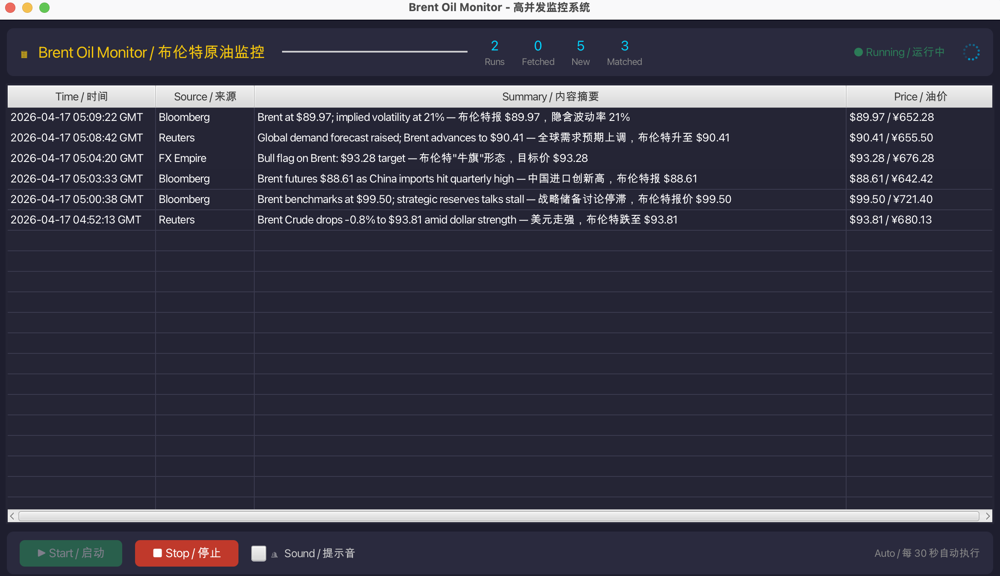

# Brent Oil Monitor / 布伦特原油监控系统

**High-Concurrency Brent Crude News Monitoring System**

A macOS desktop application built with Java 17 + JavaFX that monitors Brent crude oil news every 30 seconds, demonstrating real-world concurrent programming patterns for technical interviews.

每 30 秒自动抓取多家新闻源（Reuters、Bloomberg、FX Empire）的布伦特原油相关新闻，通过 JavaFX 实时展示，完整展示生产级并发编程架构。

---

## Project Overview / 项目概述

Brent Oil Monitor automatically fetches news from multiple sources every 30 seconds, filters for Brent crude oil related content, and displays results in a real-time GUI. The application is designed to showcase production-grade concurrency architecture.

布伦特原油监控系统每 30 秒自动从 Reuters（路透社）、Bloomberg（彭博）、FX Empire 三家新闻源抓取布伦特原油相关新闻，经过去重、过滤后通过 JavaFX 图形界面实时展示。应用专为技术面试设计，展示生产级并发编程能力。


## Highlights | 项目亮点

- **Production-grade concurrency architecture** (ThreadPoolExecutor + BlockingQueue + Token Bucket Rate Limiter)  
  **生产级并发架构设计**（线程池 + 阻塞队列 + 令牌桶限流）

- **Real-time data pipeline** (Producer → Queue → Consumer → UI)  
  **实时数据处理流水线**（生产者 → 队列 → 消费者 → UI）

- **Backpressure handling & peak shaving** using BlockingQueue  
  **基于 BlockingQueue 实现背压机制与削峰填谷**

- **Lock-free programming with CAS** (AtomicInteger, AtomicLong, ConcurrentHashMap)  
  **基于 CAS 的无锁编程**（原子类 + 并发容器）

- **Custom ThreadPool tuning** (core/max threads, SynchronousQueue, rejection strategy)  
  **自定义线程池调优**（核心线程/最大线程/零缓冲队列/拒绝策略）

- **Rate limiting with Token Bucket algorithm** (Semaphore + CAS)  
  **令牌桶限流算法实现**（Semaphore + CAS）

- **Thread-safe UI updates** using JavaFX Platform.runLater()  
  **通过 Platform.runLater 实现线程安全 UI 更新**

- **Graceful shutdown & resource management** (awaitTermination + interrupt)  
  **优雅关闭与资源管理**（线程池关闭 + 中断机制）

- **macOS native app packaging** using jpackage  
  **基于 jpackage 打包 macOS 原生应用**

## Architecture / 架构设计

```
┌──────────────────────────────────────────────────────────────────┐
│            MonitorScheduler (ScheduledExecutorService)           │
│                     scheduleAtFixedRate(30 sec)                  │
└──────────────────────────────┬───────────────────────────────────┘
                               │ coordinates / 协调调度
              ┌────────────────┴────────────────┐
              ▼                                 ▼
┌─────────────────────────┐       ┌──────────────────────────┐
│    FetcherRunner        │       │     NewsProcessor        │
│    (Producer Side)       │       │     (Consumer Side)      │
│                         │       │                          │
│  ThreadPoolExecutor(3)   │       │  FixedThreadPool(n)      │
│   └─ Reuters Fetcher     │       │   └─ consumeLoop()       │
│   └─ Bloomberg Fetcher   │ ───▶  │                          │
│   └─ FXEmpire Fetcher   │ QUEUE │  Keyword Filter           │
│                         │       │  Deduplication            │
│  TokenBucketRateLimiter  │       │  Stats Update             │
└─────────────────────────┘       └──────────────────────────┘
                                        │
                                        ▼
                               ┌──────────────────────────┐
                               │    JavaFX TableView      │
                               │    (UI Thread)           │
                               │     Brent Monitor App    │
                               └──────────────────────────┘
```

## Demo | 项目截图


---

## High Concurrency Design / 高并发设计要点

### 1. ThreadPoolExecutor — 核心并发基石

```java
ThreadPoolExecutor executor = new ThreadPoolExecutor(
    3,                              // corePoolSize: 3 sources = 3 threads
    6,                              // maxPoolSize: burst to 6
    60L, TimeUnit.SECONDS,           // keepAliveTime: scale-down after idle
    new SynchronousQueue<>(),        // no buffer, direct handoff
    new ThreadFactory("Fetcher-%d"),// named threads
    new RejectedExecutionHandler()  // handle overload
);
```

**设计思路 / Design Rationale:**
- **Fixed core pool (3):** 每个新闻源一个线程，避免资源碎片化
- **Dynamic max (6):** 应对突发场景（重试逻辑、多源同时响应）
- **SynchronousQueue:** 零缓冲，任务直接交递给线程，限流器处理背压而非队列
- **Named threads:** 便于调试（如 `Fetcher-1`、`Processor-2`）

### 2. BlockingQueue — 生产者-消费者缓冲区

```java
BlockingQueue<NewsItem> queue = new ArrayBlockingQueue<>(100, true);
```

**作用：削峰填谷 / Role: Peak Shaving & Valley Filling**

| 场景 / Scenario | 行为 / Behavior |
|-----------------|-----------------|
| **峰值（生产者快，消费者慢）** | 队列累积最多 100 条，满时 `put()` 阻塞 Fetcher，自动背压 |
| **谷值（生产者慢，消费者快）** | Consumer 调用 `take()` 无数据时阻塞，不消耗 CPU |
| **平衡状态** | 队列稳定在某个水位，双方自动调节速度 |

### 3. TokenBucketRateLimiter — QPS 限流

```java
TokenBucketRateLimiter limiter = new TokenBucketRateLimiter(
    maxConcurrent: 3,     // Semaphore permits（并行请求上限）
    tokensPerSecond: 10   // Token 补充速率（QPS 上限）
);
```

**原理 / How it works:**
- **Semaphore:** 控制最大并发请求数（防止线程爆炸）
- **Token refill:** 随时间补充 token（平滑限流，而非突发）
- **Blocking acquire:** 无可用 token 时线程阻塞（零 CPU 消耗）

### 4. CAS 与线程安全统计

```java
// AtomicInteger — 无锁计数器
private final AtomicInteger runCount = new AtomicInteger(0);
public void incrementRun() { runCount.incrementAndGet(); }

// ConcurrentHashMap — 无锁去重
private final ConcurrentHashMap<String, Boolean> cache = new ConcurrentHashMap<>();
public boolean isDuplicate(String hash) {
    return cache.putIfAbsent(hash, Boolean.TRUE) != null;
}

// AtomicLong — 无锁 Token Bucket 状态
private final AtomicLong tokens = new AtomicLong(maxTokens);
```

**为什么用 CAS 而不是 synchronized:**
- `synchronized`：获取对象监视器，阻塞其他线程，上下文切换开销大
- `AtomicInteger/AtomicLong`：使用 CPU `lock` 指令（CAS），非阻塞，简单计数器快约 10 倍
- `ConcurrentHashMap`：分段锁机制，读操作几乎无锁

### 5. 去重缓存 — 内容指纹

```java
// O(1) 查找，内容 hash 作为指纹
public boolean isDuplicate(String contentHash) {
    Boolean existing = cache.putIfAbsent(contentHash, Boolean.TRUE);
    return existing != null; // True = 重复，False = 新数据
}
```

使用 `String.valueOf(content.hashCode())` 作为指纹。短字符串比较短路机制避免长字符串比较开销。

---

## Architecture Description / 架构详解

### Package Structure / 包结构

```
com.brentmonitor/
├── model/           # 数据模型（NewsItem, MonitorStats）
├── scheduler/        # ScheduledExecutorService 调度编排
├── fetcher/          # NewsFetcher 接口 + 3 个实现
│   └── impl/        # Reuters, Bloomberg, FXEmpire（模拟数据源）
├── queue/            # ArrayBlockingQueue 共享缓冲区
├── processor/        # Consumer：过滤、去重、统计
├── cache/            # DeduplicationCache（ConcurrentHashMap）
├── limiter/          # TokenBucketRateLimiter（Semaphore + CAS）
└── ui/               # JavaFX MonitorUI（TableView + 控件）
```

### Data Flow / 数据流

1. **Scheduler** 每 30 秒触发 `scheduleAtFixedRate`
2. **FetcherRunner** 向 ThreadPoolExecutor 提交 3 个并发抓取任务
3. 每个 **Fetcher** 获取限流器 token，模拟网络 I/O 延迟，返回 `List<NewsItem>`
4. 数据条目放入 **BlockingQueue**（队列满时阻塞 = 背压）
5. **NewsProcessor** 消费者调用 `take()` 取数据（队列空时阻塞）
6. 每个 processor 检查 **DeduplicationCache**（CAS，O(1)）
7. 关键词匹配且非重复 → 更新 **AtomicInteger** 统计 + 通过 `Platform.runLater()` 推送到 **JavaFX UI**
8. **TableView** 实时展示，**最新消息排在最上面，时间统一显示为 GMT**

---

## Tech Stack / 技术栈

| 组件 / Component | 技术 / Technology |
|-----------------|------------------|
| Language / 编程语言 | Java 17 |
| GUI | JavaFX 17 (OpenJFX) |
| Concurrency / 并发 | java.util.concurrent |
| Build Tool / 构建工具 | Maven 3.8+ |
| Packaging / 打包 | jpackage (JDK 17 built-in) |

**无外部并发库** — 所有并发均使用标准 `java.util.concurrent`，适合面试展示。

---

## How to Run / 运行方式

### Prerequisites / 前置条件
- Java 17+（OpenJDK 或 Temurin）
- Maven 3.8+

### Run from source / 从源码运行

```bash
cd Brent-Demo-New/brent-monitor

# Build / 构建
mvn clean package -DskipTests

# Run / 运行
java --module-path /path/to/javafx-sdk/lib \
     --add-modules javafx.controls,javafx.graphics \
     -jar target/brent-monitor.jar
```

或使用构建脚本：

```bash
./build.sh
java -jar brent-monitor/target/brent-monitor.jar
```

---

## How to Build macOS App / macOS App 构建方式

### Step 1: 安装 JavaFX SDK（jpackage 必需）

```bash
# Download from https://openjfx.io/
# Or via Homebrew:
brew install openjfx

# Set environment variable:
export JAVAFX_HOME=/path/to/openjfx-sdk
```

### Step 2: 先构建 JAR

```bash
cd Brent-Demo-New
./build.sh
```

### Step 3: 打包为 .app

```bash
./build-macos-app.sh
```

输出文件：
- `dist/BrentMonitor.app` — macOS 应用包（⛽ 石油图标）
- `dist/BrentMonitor.dmg` — macOS 安装包（若 hdiutil 可用）

### Manual jpackage command / 手动 jpackage 命令

```bash
jpackage \
  --type app-image \
  --input brent-monitor/target \
  --main-jar brent-monitor.jar \
  --dest dist \
  --name BrentMonitor \
  --app-version 1.0.0 \
  --vendor BrentMonitor \
  --description "Brent Crude Oil News Monitor" \
  --mac-package-identifier com.brentmonitor.app \
  --mac-package-name "Brent Monitor" \
  --module-path "$JAVAFX_HOME/lib" \
  --add-modules javafx.controls,javafx.graphics
```

---

## Interview Highlights / 面试要点

以下是面试中可以重点强调的关键点：

### 1. 生产者-消费者模式
> "我用 BlockingQueue 作为 Fetcher（生产者）和 Processor（消费者）之间的通信通道，解耦了两者——它们以独立速度运行，队列充当缓冲区。"

### 2. 线程池设计
> "FetcherRunner 使用 ThreadPoolExecutor，核心线程数 3（每个新闻源一个线程），最大线程数 6 用于应对突发，使用 SynchronousQueue 零缓冲，队列满时生产者自动阻塞产生背压。"

### 3. 限流机制
> "我用 Semaphore + AtomicLong 实现了 Token Bucket 限流器。Semaphore 限制最大并发请求数（最多 3 个并行抓取），token 补充机制平滑限流。线程在 acquire() 上阻塞而非自旋等待——零 CPU 消耗。"

### 4. CAS 与无锁编程
> "所有统计数据使用 AtomicInteger/AtomicLong 替代 synchronized 计数器。去重使用 ConcurrentHashMap.putIfAbsent()——单次原子 CAS 操作完成检查和插入，避免检查和插入之间的竞态条件。"

### 5. 线程安全的 GUI 更新
> "JavaFX 是单线程的。我用 Platform.runLater() 将后台线程的数据安全推送到 UI。TableView 的 ObservableList 在内部处理自己的同步。"

### 6. 优雅关闭
> "FetcherRunner 和 NewsProcessor 都实现了正确的 shutdown()，使用 awaitTermination() 和 Thread.interrupt() 支持，关闭时无资源泄漏。"

---

## File Structure / 文件结构

```
Brent-Demo-New/
├── brent-monitor/
│   ├── pom.xml
│   └── src/main/java/com/brentmonitor/
│       ├── Main.java
│       ├── model/
│       │   ├── NewsItem.java
│       │   └── MonitorStats.java
│       ├── scheduler/
│       │   └── MonitorScheduler.java
│       ├── fetcher/
│       │   ├── NewsFetcher.java
│       │   ├── FetcherRunner.java
│       │   └── impl/
│       │       ├── ReutersNewsFetcher.java
│       │       ├── BloombergNewsFetcher.java
│       │       └── FXEmpireNewsFetcher.java
│       ├── queue/
│       │   └── NewsItemQueue.java
│       ├── processor/
│       │   └── NewsProcessor.java
│       ├── cache/
│       │   └── DeduplicationCache.java
│       ├── limiter/
│       │   └── TokenBucketRateLimiter.java
│       ├── ui/
│       │   └── MonitorUI.java
│       └── util/
│           └── Logger.java
├── dist/
│   ├── BrentMonitor.app/    ⛽ macOS App（石油图标）
│   └── BrentMonitor.dmg      macOS 安装包
├── build.sh
├── build-macos-app.sh
├── run.sh
└── README.md
```

---

## Configuration / 配置说明

编辑 `MonitorScheduler.java` 构造函数调整参数：

```java
new MonitorScheduler(
    intervalMinutes: 0.5,   // 抓取间隔（当前为 30 秒）
    initialDelaySeconds: 3  // 首次抓取延迟
);
```

---

## UI Display / 界面说明

| 功能 / Feature | 说明 / Description |
|---------------|-------------------|
| ⛽ 实时新闻列表 | TableView 实时展示，最新消息在最上方 |
| 🕐 时间显示 | 所有时间统一转换为 GMT 格式（`yyyy-MM-dd HH:mm:ss GMT`） |
| 📊 统计面板 | 实时显示 Runs / Fetched / New / Matched 数量 |
| 🔔 提示音 | 可开启新消息到达提示音 |
| ▶️ 启停控制 | Start / Stop 按钮手动控制监控 |

---

## License

MIT License — Free to use for learning and demonstration purposes.
